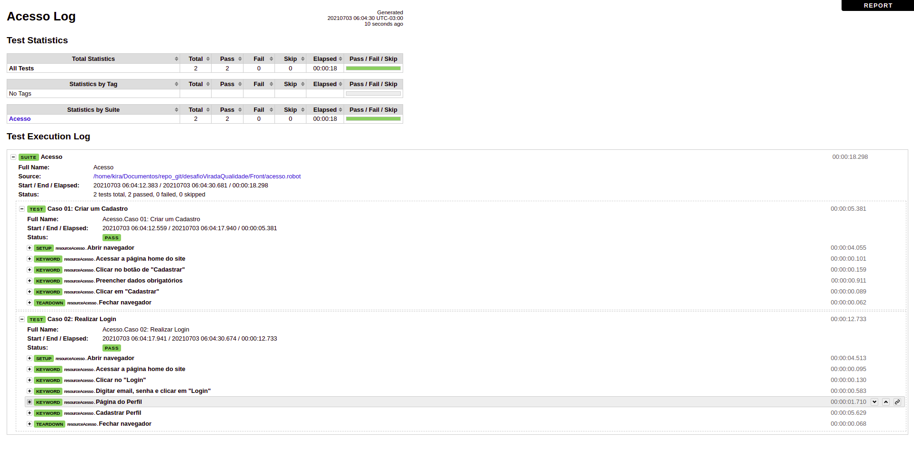
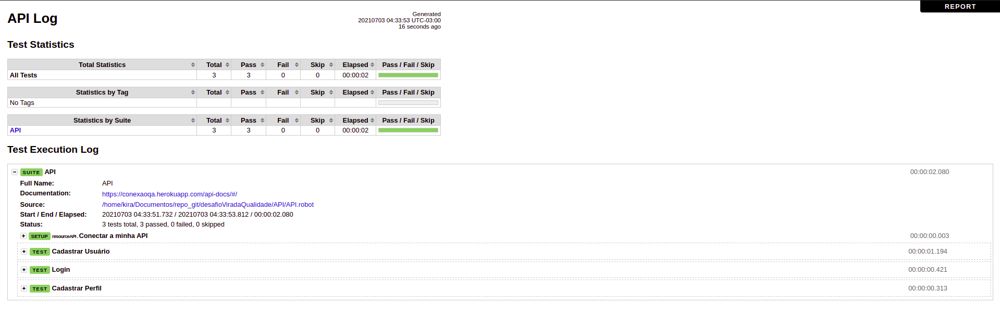

# desafioViradaQualidade

Desafio da Virada da Qualidade 02/07

# Escolhi o desafio - Desafio 2 - Testes automatizados

**URL do sistema:**

**Frontend**: https://conexaoqa.herokuapp.com/

**Backend**: https://conexaoqa.herokuapp.com/api-docs/

## Escopo de Trabalho da historia de usuário:

**Sobre o Cadastro**

1 - Todos os campos são obrigatórios
2 - Email deve ter o formato de email, ex usuario@dominio.com
3 - Senha deve ter no mínimo 6 caracteres
4 - Confirmar senha deve ser igual ao campo senha
5 - Não é permitido cadastrar usuários duplicados com mesmo email, exibir alerta de "Usuário já registrado" por 6 segundos
6 - A página de cadastro deve conter um link para página de login
7 - O sistema ainda não está integrado com o Gravatar Ao realizar um cadastro válido o usuário é automaticamente redirecionado para página de Dashboard

**Sobre o Login**

1 - Email deve ter o formato de email
2 - Senha deve ter no mínimo 6 caracteres
3 - Exibir o alerta "Credenciais inválidas" por 10 segundos quando o login for inválido
4 - A página de login deve conter um link para página de cadastro

**Sobre o Criar Perfil**

1 - Campo status e conhecimentos são obrigatórios
2 - Campos de URLs devem ter validação se o formato é válido
3 - Ao salvar um perfil, o usuário é redirecionado para a página de Dashboard
4 - No perfil não é necessário adicionar formação acadêmica ou experiência profissional.

---

Criei duas pastas Front e API:

Com os testes abertos em suas respectivas pastas faça o seguinte:

- **Front** -
  robot -d \log acesso.robot

- **API** -
  robot -d \log API.robot

---

Caso esteja na pasta raiz, faça o seguinte:

- **Front** -
  robot -d \log Front/acesso.robot

- **API** -
  robot -d \log API/API.robot

---

Vou deixar dados salvos para um novo cadastro tanto na API como no Front.

---

Testes que foram realizados antes, de alterar os dados para enviar para correção.

**Front**

**API**

